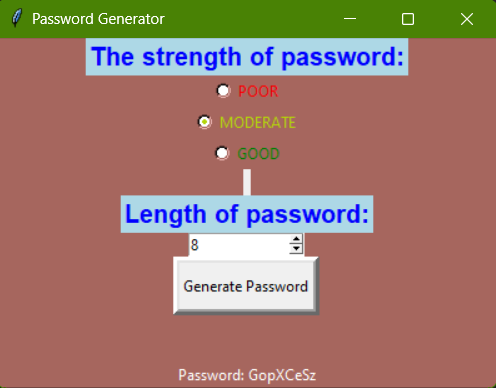

# Password-Generator

## Introduction

This Python script generates strong and secure passwords to enhance the protection of your online accounts.

## Features

- Generates strong and random passwords.
- Customizable password length.
- Option to include or exclude numbers, special characters, and uppercase letters.
- Easy-to-use command-line interface.
<li><u>Screenshot</u>
  <ul></ul>
</li>
